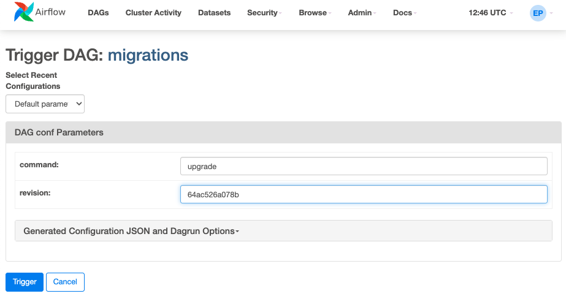

# What is BI-DAGs

BI-DAGs is a component of the monitoring project developed for the RCS-SIS group. It plays an important role in tracking key performance indicators (KPIs) to monitor progress and analyze the current situation.

BI-DAGs operates as an Apache Airflow instance dedicated to managing data harvesting from various sources including CDS, ILS, and others. The harvested data is then processed and pushed into a PostgreSQL database. Subsequently, Apache Superset retrieves this data to present it in the desired format for analysis and reporting.

# BI-DAGs Setup Guide

This README provides a step-by-step guide on setting up your environment for running BI-DAGs with Airflow.

## Prerequisites

Before you begin, ensure you have `pyenv` installed on your system. If you don't have `pyenv` installed, please follow the instructions [here](https://github.com/pyenv/pyenv#installation).

## Installation Steps

### 1. Set Up Python Environment

First, we'll set up a Python environment using `pyenv`.

```sh
# Define the desired Python version
export PYTHON_VERSION=3.10.11

# Install the specified Python version using pyenv
pyenv install $PYTHON_VERSION

# Set the global Python version to the installed one
pyenv global $PYTHON_VERSION

# Create a virtual environment named 'bi-dags'
pyenv virtualenv $PYTHON_VERSION bi-dags

# Activate the virtual environment
pyenv activate bi-dags
```

### 2. Navigate to Project Directory

Change your current working directory to `bi-dags`.

```sh
cd bi-dags
```

### 3. Install Dependencies

With your virtual environment activated, install the necessary dependencies.

```sh
pip install -r requirements.txt
```

### 4. Set Airflow Home

Configure the Airflow home environment variable.

```sh
export AIRFLOW_HOME=$PWD
```

### 5. Start Airflow

Initialize and start Airflow using the standalone command.

```sh
airflow standalone
```

### 6. Start Postgres with Docker Compose

If you're using Docker to manage your Postgres database, start the service.
IMPORTANT: Please add CDS_TOKEN value in Docker compose file

```sh
docker-compose -f docker-compose.standalone.yaml up
```

### 7. Add Airflow Connections via UI

Lastly, add the necessary Airflow connections through the UI.

- Navigate to Admin -> Connections in the Airflow UI.
- Click on "Add" and fill in the details:
  - Connection Id: `superset`
  - Login: `airflow`
  - Database: `airflow`
  - Password: `airflow`
  - Host: `localhost`
  - Port: `5432`
  - Connection Type: `postgres`

More information, how to manage db connections can be found [here](https://airflow.apache.org/docs/apache-airflow/2.8.2/howto/connection.html).

After completing these steps, your environment should be set up and ready for running BI-DAGs with Airflow.

## Running with Docker Compose

1. To start the services using Docker Compose, simply run:

```sh
docker-compose up
```

All the required environment variables are already configured in the `docker-compose.yml` file.

### Creating a User in Airflow

Before logging into the Airflow UI, you need to create a user. Follow these steps to create a user in the Airflow web container from the command line:

1. Ensure the Airflow services are running.
2. Access the Airflow web container by running:

```sh
docker-compose exec airflow-web bash
```

3. Create a new Airflow user with the following command (replace `<username>`, `<password>`, `<firstname>`, `<lastname>`, and `<email>` with your desired values):

```sh
airflow users create     --username <username>     --password <password>     --firstname <firstname>     --lastname <lastname>     --role Admin     --email <email>
```

Example:

```sh
airflow users create     --username admin     --password admin     --firstname Admin     --lastname User     --role Admin     --email admin@example.com
```

After creating the user, you can log in to the Airflow UI with the credentials you specified.

## Database Migrations

### Via Command Line

By following these guidelines, you can seamlessly manage and track database migrations within your Airflow environment.
Database migrations are done by running [migrations](https://github.com/cern-sis/bi-dags/blob/main/dags/migrations/migrations.py) DAG.
To create a new migration you need:

1. **Navigate to the Migrations Folder**:
   Open your terminal and change to the migrations directory by running:
   ```bash
   cd $AIRFLOW_HOME/dags/migrations
   ```
2. **Create a New Migration Revision:**
   Use the Alembic command to create a new revision. For example:

```bash
alembic revision -m "My Database Revision"
```

This command generates a new migration script.

3. **Edit the Migration Script:**
   Modify the newly created migration script to include your desired upgrade and downgrade actions.

4. **Apply the Migration:**
   To execute the migration, trigger the migrations DAG with the necessary parameters (as an example, revision number 64ac526a078b):

```python
{"command": "upgrade", "revision": "64ac526a078b"}
```

To downgrade to a specific version, such as 64ac526a078b, use the following command:

```python
{"command": "downgrade", "revision": "64ac526a078b"}
```

If you wish to downgrade to the very first version (prior to the first Alembic migration), enter "base" instead of a revision number.

This can be done through the API by passing the parameters, or via the UI by initiating the DAG with these settings.

5. **Push the Version File:**
   Ensure to commit and push the updated version file to the main branch to apply the migrations in QA or PRODUCTION environments.

### Via Airflow UI:

1. Select the "migration" DAG:
   - In the list of DAGs, find and click on the "migration" DAG to open its details page.
     Trigger the "migration" DAG:
   - Click on the "Trigger DAG" button, represented by a play icon or labeled as "Trigger DAG" on the top right of the DAG details page.
     Enter Parameters:
   - A parameters selection window will appear.
     Type the desired command (either upgrade or downgrade) in the command field.
2. Enter the specific revision number in the revision field.
3. Confirm and Trigger:
   - Review the parameters you have entered.
     Click the "Trigger" button to start the DAG with the specified parameters



# Important node regarding Annual Report Dags

Annual Report Dags updates database tables every time it collects new data. If the data was previously collected, it will update the existing entries. The data covers every year from 2004 up to the current year.
